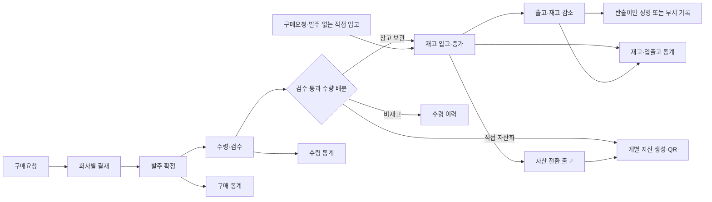

# CompanyFlow PRD v1.3 — 개발 착수용 통합 문서

| 항목 | 내용 |
|---|---|
| 파일 | CompanyFlow_PRD_v1.3_Customizable_Modular_ERP.md |
| 최초 작성 | 2026-09-06 |
| 통합 개정 | 2026-09-15 |
| 개발 착수 예정 | 2026-09-15 |
| 제품 | 한국 기업에서 사용하는 회사별 맞춤형 업무관리 웹앱 |
| 문서 용도 | 기능·화면·데이터·기술·개발 순서·완료 기준을 한 파일에서 관리 |
| 상태 표기 | **확정**: 공통 요구사항 / **가변**: 회사 설정 또는 구현 선택 / **미정**: 검증·추가 결정 필요 |

이 문서는 기존 v1.2에서 이어온 요구사항과 이후 대화에서 정한 변경사항을 통합한 개발 기준이다. 기능의 구현 완료를 뜻하지 않는다. 요구사항을 변경하면 이 파일의 수정 포인트와 의사결정 로그도 함께 갱신한다.

## 목차

1. 제품 목표와 범위
2. 사용자와 운영 방식
3. 전체 업무 흐름과 공통 처리 규칙
4. 국내 UI·UX 방향과 화면 구성
5. 모듈별 기능 요구사항
6. 기본 데이터 모델과 확장 필드
7. 회사별 설정·Workflow·Document Template
8. 통계와 내보내기
9. 기술 스택과 데이터 저장 정책
10. 공통 엔진과 구현 구조
11. 개발 순서와 첫날 작업
12. 수용 기준
13. 향후 수정 포인트와 의사결정 로그

## 1. 제품 목표와 범위

### 1.1 핵심 목표

직원·입퇴사·명찰, 구매, 입출고·재고, 자산, 계약을 연결해서 관리한다. 일반 비품은 구매 항목에서 별도 구분하며 구매·입출고 통계를 제공한다.

**새 회사는 코드 수정, 앱 재배포, 수동 DB 구조 변경 없이 설정과 Template만으로 사용할 수 있어야 한다.** 설정으로 지원할 범위는 이 문서의 필드 유형·조건·처리 명령 안에서 정의한다. 새로운 종류의 업무 기능 자체를 추가하는 경우에는 공통 모듈을 개발하고 회사 설정으로 활성화한다.

### 1.2 설계 원칙 — 확정

- **기본 기능 + 회사별 커스터마이징 레이어:** 수량 계산·거래 확정·회사 격리는 공통 기능으로, 업무 용어·필드·단계·화면·문서는 회사 설정으로 처리한다.
- **회사별 수정 격리:** B회사의 요청으로 변경한 설정·Template·기능 활성화는 B회사에만 적용하며 A회사의 설정·업무 동작·문서를 유지한다.
- **Local-first:** 업무 원본과 문서는 회사의 지정 PC에 저장한다.
- **한 번 입력하면 연결:** 구매 수령과 입출고 확정 결과를 재고·자산·통계에 연결한다.
- **기록 보존:** 확정 거래를 직접 덮어쓰거나 삭제하지 않고 정정·반대 거래로 이력을 남긴다.
- **중복 방지:** 확정 버튼 재클릭·재시도·Relay 재수신에도 같은 업무를 한 번만 반영한다.
- **국내 사용성:** 한글 업무 용어와 국내 ERP·그룹웨어의 처리 흐름을 우선 참고한다.

### 1.3 구현 범위

| 영역 | 이번 개발에 포함할 최소 범위 |
|---|---|
| 직원·입퇴사·명찰 | 직원 정보, 입사·퇴사 체크리스트, 자산 배정·회수 연결, 명찰 생성·출력 |
| 공통 기준정보 | 부서, 직원 참조, 거래처·공급사, 품목, 구매 구분, 단위, 창고·위치 |
| 구매관리 | 구매요청, 회사별 결재, 발주, 분할수령·검수, 반품, 일반 비품 전용 조회 |
| 입출고·재고관리 | 구매 연결 입고, 구매요청·발주 없는 직접 입고, 출고, 반출, 반납, 공급사 반품, 창고 이동, 실사·조정, 현재고 |
| 자산관리 | 고유 자산번호·QR, 등록, 배정, 이관, 반납, 수리, 폐기, 구매 원본 연결 |
| 계약관리 | 직접 등록, 스캔 PDF·이미지 OCR, 사용자 확인 후 등록, 검색, 기간·갱신 알림 |
| 통계 | 구매, 수령, 입출고, 현재고, 일반 비품, Excel 내보내기 |
| 공통 기반 | 회사 생성·초기 설정·사용자 연결, 권한, Workflow·Document Template, 모듈 ON/OFF, 알림, 암호화 Relay, 백업·복원 |

자재는 공통 품목의 구매 구분으로 관리하고 구매·입출고·재고 흐름에 연결한다. 별도의 자재 전용 화면은 필요할 때 확장한다. 

다중 PC 공동 편집, 회계·급여·세무 처리, 법적 효력을 갖춘 전자서명 서비스, 재고 원가 평가, 다중 단위 환산·lot 관리는 후속 설계 항목이다.

## 2. 사용자와 운영 방식

### 2.1 기본 역할 — 가변

| 역할 | 기본 업무 |
|---|---|
| 운영 관리자 | 회사 생성, 최초 회사 관리자 연결, 라이선스·사용 허용 모듈 관리 |
| 회사 관리자 | 회사 설정, 사용자 권한, Template 게시, 백업·복원 |
| 구매 담당자 | 요청 확인, 발주, 수령·검수, 공급사 반품 |
| 재고·자산 담당자 | 입출고 확정, 반출, 창고 이동, 실사, 자산 배정·회수 |
| 결재자 | 지정된 요청의 검토·승인·반려 |
| 일반 직원 | 허용된 요청 입력과 본인 관련 업무 확인 |

한 사람이 여러 역할을 맡을 수 있다. 조회·입력·확정·결재·금액 열람·내보내기·설정 권한을 별도로 설정한다. 로그인 계정과 직원 정보는 분리하고 필요할 때 연결한다.

운영 관리자와 회사 관리자의 권한은 구분한다. 운영 관리자는 회사 등록을 담당하며 회사의 로컬 업무 원본·상세 설정 접근 권한을 자동으로 갖지 않는다. 최초 운영 관리자 권한은 서버의 별도 운영 절차로 부여하고, 일반 사용자가 가입·프로필 수정으로 자신에게 부여할 수 없게 한다.

### 2.2 초기 운영 단위 — 확정

- 회사별 지정 PC의 한 브라우저 프로필을 업무 원본 장치로 사용한다.
- 같은 PC의 사용자도 로그인 계정과 권한으로 구분한다.
- 회사별 DB와 파일 영역을 분리하고, 회사 전환 시 이전 회사의 화면·검색 결과·Worker 상태를 정리한다.
- 다중 탭의 동시 쓰기는 초기에는 한 탭만 허용하고 다른 탭에는 사용 중 안내를 제공한다.
- 휴대폰의 초기 업무는 QR 스캔을 통한 번호 입력, 반출 요청 입력, 사진·계약서 업로드 등 암호화 전달 중심이다.
- 휴대폰의 요청은 관리자 PC가 수신하여 권한·수량·필수항목을 검증한 뒤 처리한다. 전송 성공과 업무 확정을 구분한다.
- PC의 QR 조회는 로컬 자산 상세로 연결한다. 휴대폰에서 PC 원본의 최신 상세·현재고를 조회하는 방식은 암호화 조회 설계 후 확장한다.

### 2.3 회사 생성과 초기 설정

**초기 기본 방식은 운영 관리자가 회사를 등록하고, 해당 회사 관리자가 지정 PC에서 초기 설정을 완료하는 것이다.** 생성·권한 검증·회사별 저장 분리는 확정 요구사항이며, 향후 회사의 직접 가입·생성 방식은 별도 결정한다.

```text
운영 관리자: 회사 관리 → 새 회사 생성 → 회사 정보·최초 관리자 지정
회사 관리자: 계정 연결 → 지정 PC 첫 로그인 → 초기 설정 → 사용 시작
```

#### 생성 화면의 입력 항목

| 항목 | 입력·저장 기준 |
|---|---|
| 회사명 | 필수. 회사 선택·운영 관리에 사용할 표시 이름 |
| 회사 ID·회사코드 | ID는 시스템이 자동 생성한다. 표시용 코드는 자동 제안하고 중복 확인 후 변경 가능 |
| 최초 회사 관리자 | 필수. 기존 인증 계정 선택 또는 초대할 이메일 입력 |
| 라이선스·허용 모듈 | 운영 관리자가 지정한다. 회사 관리자는 허용 범위 안에서 실제 사용 모듈을 선택 |
| 기본 설정 묶음 | 사용할 필드·상태·Workflow·Document Template의 게시 버전을 선택 |
| 상세 회사 정보 | 로고·주소·연락처·사업자등록번호는 선택. 회사 관리자의 초기 설정에서 로컬에 저장 |

#### 생성부터 사용 시작까지

1. **회사 등록:** 운영 관리자가 입력값을 확인하고 생성한다. 화면은 최초 전송 전에 생성 요청 ID를 만들고 재시도에 같은 ID를 사용한다. 서버에서 생성 권한·코드 중복·라이선스·모듈 허용을 검증하고 해당 요청 ID에 회사 ID·생성 작업을 연결한다. 응답이 유실되어도 같은 요청에는 기존 생성 결과를 반환한다.
2. **최초 관리자 연결:** 기존 인증 계정은 해당 회사의 관리자 멤버십에 연결한다. 새 계정은 초대 링크에서 계정·이메일 확인을 마친 뒤 연결한다. 초대만 받은 상태에는 업무 권한을 부여하지 않는다.
3. **원본 PC 지정:** 회사 관리자가 온라인 상태에서 로그인하고 대상 회사명을 확인한 뒤 `이 PC를 업무 원본 장치로 설정`을 선택한다. 휴대폰 로그인은 원본 PC 초기화로 취급하지 않는다.
4. **로컬 저장 초기화:** OPFS 지원·영속 저장·DB 열기·파일 쓰기·탭 잠금을 검사하고 회사 ID별 DB·파일 영역을 자동 생성한다. 수동 DB 작업은 요구하지 않는다.
5. **회사 전용 기본 설정 생성:** 선택한 기본 설정·필드 정의·Workflow·Document Template 버전을 회사 소유의 로컬 설정으로 복사한다. 기반 버전을 기록하며 다른 회사나 공통 기본 설정을 수정하지 않는다.
6. **업무 설정:** 실제 사용 모듈, 역할·필수항목·상태·라벨·화면·알림을 선택한다. 사용할 모듈에 필요한 부서·창고·단위 등 최소 기준정보를 입력하거나 기본값으로 만든다. 품목·직원 전체 등록은 사용 시작 후에도 가능하다.
7. **검증·사용 시작:** 관리자 인증·멤버십·라이선스, 로컬 저장, 초기 설정 게시, 모듈 의존성·필수 기준정보를 확인한다. 통과하면 해당 PC에 `사용 가능`을 표시하고 홈으로 이동한다. 암호화 Relay·OCR 등은 각 기능의 검증 완료 조건에 따라 별도로 활성화한다.
8. **사용자 추가:** 회사 관리자가 사용자 초대·기존 계정 연결과 역할 배정을 한다. 서버는 관리자의 해당 회사 권한을 검증하고, 사용자 확인 완료 후 멤버십을 활성화한다. 로그인 후 회사 목록에는 활성 멤버십이 있는 회사만 표시한다.

#### 상태·실패·재시도 규칙 — 확정

- 회사 중앙 등록 상태와 PC 초기화 상태를 구분한다. 화면에는 `관리자 연결 대기 → PC 초기화 대기 → 사용 가능`을 표시하고 실패한 단계·원인·다시 시도 버튼을 제공한다.
- 중앙에는 최소 등록·연결·기기·진행 상태만 저장한다. 상세 회사 정보·업무 설정·Template 원본은 로컬에 저장한다. 초기화 완료 표시는 관리자 권한·라이선스를 대신하지 않는다.
- 중앙 등록과 로컬 초기화는 단계별 완료 기록·생성 작업 ID로 이어서 처리한다. 재클릭·중단·재로그인 때 같은 회사 ID로 재개하고 회사·멤버십·DB·기본 설정을 중복 생성하거나 기존 데이터를 초기화하지 않는다.
- 최초 PC 초기화는 중앙에서 회사별 원본 장치를 하나만 원자적으로 예약하고 완료 후 확정한다. 두 PC가 동시에 시작해도 한 장치만 진행하며, 중단된 초기화는 예약된 장치의 같은 작업으로 재개한다.
- 이미 원본 PC가 등록된 회사에 새 PC로 접속하면 빈 업무 원본을 만들지 않는다. 백업·복원과 원본 장치 교체 절차로 안내한다. 복구 준비가 끝나기 전에는 기존 원본 장치 등록을 바꾸지 않는다.
- 등록된 원본 PC에서도 브라우저 저장소 삭제 등으로 업무 DB가 없어지면 최초 생성으로 처리하지 않고 백업 복원으로 안내한다.
- B회사 생성·초기화·사용자 연결은 B회사 영역에서만 처리하며 A회사의 데이터·설정·활성 버전을 유지한다.
- 가입 후 연결된 회사가 없는 사용자는 회사 연결·초대 수락 안내를 본다. 회사 생성 권한이나 다른 회사 접근 권한을 자동 부여하지 않는다.

## 3. 전체 업무 흐름과 공통 처리 규칙

### 3.1 전체 흐름



결재 단계는 회사 설정에 따라 추가·생략할 수 있다. 결재 완료와 발주·재고 거래 확정은 별개의 처리다. 구매요청이 없는 발주와 구매요청·발주 모두 없는 직접 입고를 지원한다. 직접 입고는 입출고·재고 메뉴에서 독립적으로 시작한다.

### 3.2 용어

| 용어 | 의미 |
|---|---|
| 구매 구분 | 일반 비품·자재·서비스 등 구매 항목의 분류 |
| 수령 | 발주 물품을 실제로 받았다는 기록 |
| 검수 통과 수량 | 정상 판정되어 창고·자산·비재고로 배분할 수량 |
| 입고·출고 | 재고 원장에 반영되는 수량 증가·감소 거래 |
| 직접 입고 | 구매요청·발주·구매 수령 기록 없이 등록하는 재고 입고 거래 |
| 반출 | 사람 또는 부서가 가져가는 출고 유형 |
| 반납 | 유효한 과거 출고·반출을 참조해 되돌아온 수량 |
| 공급사 반품 | 과거 수령 물품을 공급사에 돌려보내는 기록 |
| 자산 전환 | 재고 수량을 줄이고 고유 자산을 생성하는 처리 |
| 확정 | 검증을 통과하여 업무 효과와 관련 기록을 함께 저장한 상태 |

### 3.3 공통 처리 규칙 — 확정

- 초안은 현재고와 확정 거래 통계에 반영하지 않는다.
- 회사별 표시 상태·결재 단계와 내부 업무 명령을 분리한다. 상태 이름 문자열로 재고 증감을 결정하지 않는다.
- 발주 확정, 수령 확정, 입출고 확정, 이동, 정정, 자산 전환은 공통 엔진의 명령으로 실행한다.
- 업무 기록·원장·자산 생성·중복방지 기록은 필요한 범위에서 같은 SQLite 트랜잭션으로 저장한다. 실패하면 전체를 되돌린다.
- 확정 당시의 품목명·구매 구분·단위·부서명·반출자명·단가 등을 보존한다. 기준정보 변경으로 과거 거래와 통계가 바뀌지 않게 한다.
- 확정 거래 정정은 원거래와 연결한다. 후속 출고·자산 생성 등이 있는 수령은 연결된 거래 검증 없이 취소하지 않는다.
- 수량·금액은 정해진 소수점 정밀도로 계산하고 이진 부동소수점 오차가 합계에 반영되지 않게 한다.
- 초기 품목은 기준 단위 하나를 사용한다. 통화·단위가 다른 값을 하나의 수량·금액 합계로 섞지 않는다.

## 4. 국내 UI·UX 방향과 화면 구성

### 4.1 기본 방향 — 국내 사용 기준은 확정, 세부 배치는 가변

**한글 업무 메뉴 + 검색·필터가 있는 표 목록 + 연결된 상세 화면 + 짧은 처리 단계**를 기본으로 한다.

밝은 배경과 절제된 강조색을 사용하고 모든 모듈에서 버튼 위치·입력 방식·상태 표시를 통일한다. 초안·확정·반려·취소는 색과 글자로 함께 구분한다. 필수항목 오류는 해당 입력란 옆에 표시하고 키보드 이동·초점 표시를 제공한다.

한국어, 서울 시간대, 원화, 숫자의 자리 구분을 기본값으로 제공하며 회사가 변경할 수 있다. 날짜 입력·표시와 통계의 업무 기준일은 같은 회사 설정을 사용한다.

### 4.2 우선 레퍼런스

아래 공식 자료의 업무 흐름과 화면 패턴을 CompanyFlow 범위에 맞게 적용한다.

| 영역 | 공식 레퍼런스 | 적용할 패턴 |
|---|---|---|
| 전체 업무·결재 | [다우오피스 전자결재](https://daouoffice.com/features_approval.jsp) | 결재 대기·진행·완료, 신청자·부서·결재선·첨부 확인 |
| 구매 | [이카운트 구매관리](https://www.ecount.com/kr/ecount/product/purchasing_overview) | 요청 → 발주 → 수령 연결, 기존 거래 불러오기, 미수령 현황 |
| 입출고·재고 | [이카운트 재고관리](https://www.ecount.com/kr/ecount/product/inventory_overview), [창고관리](https://www.ecount.com/kr/ecount/product/inventory_location-management) | 현재고 자동 반영, 품목·창고별 현황, 부족 수량 안내 |
| 회사별 양식·필드 | [하이웍스 결재 양식](https://main.hiworks.com/product/function/groupware/approval), [다우오피스 Works](https://daouoffice.com/works.jsp) | 기본 양식 수정, 결재선·입력 항목 설정, 목록·권한 설정 |
| 계약 | [모두싸인 캐비닛](https://modusign.co.kr/cabinet/features), [스캔 계약서 OCR 안내](https://blog.modusign.co.kr/solution/cabinet/paper-contract-digital-conversion-ocr-guide) | 업로드, 핵심 정보 추출, 계약 검색·기간 알림 |
| 휴대폰 메뉴 | [네이버웍스 모바일 설정](https://help.worksmobile.com/ko/admin-guides/settings/customize/mobile-app/) | 자주 쓰는 기능 바로가기, 회사별 메뉴 표시·순서 |

보조 자료는 [Linear 상세 미리보기](https://linear.app/docs/peek), [Snipe-IT 자산 이력](https://snipeitapp.com/product), [Rossum 추출값 검증](https://knowledge-base.rossum.ai/docs/getting-started-with-rossum)이다. 목록 위치 유지, 자산 이력, 원문 비교에 필요한 패턴을 참고한다.

### 4.3 메뉴와 핵심 화면

로그인 후 회사 선택을 제공하며, 초기 설정이 끝나지 않은 회사는 2.3의 설정 화면으로 안내한다. 운영 관리자용 `회사 관리`에서는 회사 목록·새 회사 생성·최초 관리자 연결·라이선스를 관리한다. 회사 관리자용 `초기 설정`에서는 대상 회사명과 단계별 완료 상태를 계속 표시한다.

| 메뉴 | 주요 화면과 행동 |
|---|---|
| 홈 | 결재 대기, 수령 대기, 재고 부족, 계약 만료 예정, 최근 작업 |
| 직원·입퇴사 | 직원 목록·상세, 입사·퇴사 체크리스트, 연결 자산·명찰 |
| 구매 | 요청·발주·수령 목록, 다품목 입력표, 검수·배분, 일반 비품 전용 조회 |
| 입출고·재고 | 입출고 목록, 직접 입고 등록, 반출 입력, 현재고, 품목별 원장, 창고 이동·실사 |
| 자산 | 자산 목록·상세, QR, 담당자·부서·위치, 배정·반납·수리 이력 |
| 계약 | 계약 목록·상세, 파일 업로드, 원본과 OCR 추출값 비교, 만료 일정 |
| 통계 | 기간·품목·부서·거래처 필터, 요약·차트·원거래, Excel |
| 기준정보 | 부서, 거래처, 품목, 단위, 구매 구분, 창고·위치 |
| 회사 설정 | 모듈·권한·필드·상태·Workflow·화면·알림·문서 |
| 데이터 관리 | 저장 상태, 전송·수신 대기, 백업·복원 |

PC 목록에서 상세를 확인하고 돌아와도 필터·정렬·스크롤 위치를 유지한다. 회사 기본 조회 화면과 개인의 저장된 조회 조건을 구분한다.

반출 화면은 품목 → 수량 → 창고 → 성명·부서 → 확인 순서로 구성한다. 현재고와 확정 후 예상 잔량을 보여준다.

계약 OCR 검토는 지정 PC에서 원본과 추출 입력값을 나란히 보여주고, 필드를 선택하면 근거 페이지·영역으로 이동한다. 휴대폰의 후보값 검토는 암호화 조회·응답 설계 후 확장한다.

저장 표시는 `이 기기에 저장됨`, `전송 대기`, `관리자 PC 저장 완료`, `처리 확인 필요`, `최근 백업 시각`으로 구분한다.

## 5. 모듈별 기능 요구사항

### 5.1 직원·입퇴사·명찰

| ID | 요구사항 |
|---|---|
| EMP-01 | 직원번호, 성명, 부서, 직위, 입사일, 퇴사일, 재직 상태를 관리한다. 추가 개인정보는 회사 필드 설정으로 관리한다. |
| EMP-02 | 입사 Workflow의 체크리스트·담당자·기한·첨부·완료 이력을 관리한다. |
| EMP-03 | 퇴사 Workflow에서 미회수 자산·미완료 항목을 확인하고 회수 거래와 연결한다. |
| EMP-04 | 퇴사자를 삭제하지 않고 과거 구매·반출·자산 이력과의 연결을 보존한다. |
| EMP-05 | 명찰 Template에 직원 정보를 적용하여 미리보기·PDF·출력을 제공한다. |

명찰 원본 파일은 첨부로 보존하고 브라우저 출력용 PDF·이미지 등과 구분한다. Illustrator 원본의 브라우저 직접 편집·변환 방식은 후속 결정한다.

### 5.2 품목·거래처·창고

| ID | 요구사항 |
|---|---|
| MST-01 | 품목코드·명칭·구매 구분·기준 단위·공급사·재고관리 여부·자산관리 여부를 관리한다. |
| MST-02 | 구매 구분의 기본값은 일반 비품·자재·서비스이며 회사가 추가·이름 변경·비활성화할 수 있다. |
| MST-03 | 거래처는 공급사·계약 상대방으로 함께 참조하고 명칭·연락처·메모·첨부를 관리한다. |
| MST-04 | 창고·위치와 품목별 최소재고를 관리한다. 조회·입력 가능한 창고는 권한으로 제한한다. |
| MST-05 | 사용 이력이 있는 품목·부서·거래처·창고는 삭제 대신 비활성화한다. |

**구매 구분과 재고·자산관리 방식은 별도 값이다.**

| 예시 | 구매 구분 | 재고관리 | 자산관리 |
|---|---|---|---|
| 복사용지 | 일반 비품 | 사용 | 미사용 |
| 노트북 | 일반 비품 | 창고 보관 시 사용 | 사용 |
| 외부 서비스 | 서비스 | 미사용 | 미사용 |

### 5.3 구매관리

| ID | 요구사항 |
|---|---|
| PUR-01 | 구매요청의 요청자·부서·필요일·목적·첨부와 품목별 구분·수량·단가·금액을 입력한다. |
| PUR-02 | 회사 Workflow에 따라 결재·반려·재요청을 처리한다. 금액·부서·구매 구분에 따라 결재자·필수항목을 설정한다. |
| PUR-03 | 구매요청 없이 발주를 직접 등록할 수 있다. 요청이 있으면 요청 항목을 연결하고 원요청 대비 발주량을 확인한다. 공급사·발주일·납기·통화·첨부를 관리한다. |
| PUR-04 | 한 발주서에서 일반 비품·자재·서비스를 함께 입력할 수 있다. |
| PUR-05 | 발주 항목별로 여러 차례 수령·검수하고 정상·불량·반품·미수령 수량을 조회한다. |
| PUR-06 | 일반 비품 전용 목록과 통계에서 품목·부서·공급사별 구매금액·지급량·현재고·연결 자산을 조회한다. |
| PUR-07 | 발주 취소는 미처리 잔량을 대상으로 기록한다. 이미 수령한 물품은 수령 정정·반품 처리로 연결한다. |
| PUR-08 | 발주서·구매요청서를 Document Template으로 생성하고 관련 계약을 연결한다. |

기본 표시 단계는 초안 → 요청 → 결재 → 발주 → 완료이며 반려·취소를 제공한다. 수령 진행률은 미수령·부분수령·수령완료로 계산하여 표시한다. 단계명과 결재 구성은 가변이다.

발주 항목의 누적 검수 통과 수량에서 검수 통과분의 공급사 반품 수량을 차감한 값을 순수령으로 관리한다. 잔여 발주량은 유효 발주량과 순수령을 기준으로 계산한다. 불량으로 거절된 수량은 완료 수량에 포함하지 않으며, 거절품 반환도 정상 순수령을 차감하지 않는다. 반품 후 재납품 예정 여부와 잔량 마감은 회사 규칙으로 설정한다.

### 5.4 수령·입출고·재고

| ID | 요구사항 |
|---|---|
| INV-01 | 수령의 실수령 수량을 정상·불량으로 구분하고 검수 통과 수량만 배분한다. 불량은 가용 재고에 포함하지 않는다. |
| INV-02 | 검수 통과 수량은 창고 입고 + 직접 자산화 + 비재고 수령의 합계와 같아야 한다. 품목의 관리 방식에 맞지 않는 배분은 차단한다. |
| INV-03 | 창고 배분 수량은 수령 확정과 함께 입고 원장으로 생성한다. 구매요청·발주·구매 수령이 없어도 직접 입고를 등록·확정할 수 있다. |
| INV-04 | 출고·반출 확정 시 해당 품목·창고의 현재고가 자동 감소한다. |
| INV-05 | 반납·공급사 반품은 원거래를 참조하고 누적 되돌림 수량이 원거래의 유효 수량을 초과하지 않게 한다. |
| INV-06 | 창고 이동은 원창고 출고와 대상창고 입고를 함께 확정한다. 회사 전체 재고는 변하지 않는다. |
| INV-07 | 실사에서 장부 수량과 실제 수량을 비교하고 차이를 사유가 있는 조정 거래로 확정한다. |
| INV-08 | 음수 재고·초과수령은 기본 차단하며 회사가 허용 여부를 설정한다. 허용 거래도 사유·권한·감사 이력을 남긴다. |
| INV-09 | 품목·창고별 현재고와 거래 원장을 제공하고 상세에서 원거래·정정 이력으로 이동한다. |
| INV-10 | 직접 입고에는 구매요청·발주 연결을 필수로 요구하거나 임시 구매 문서를 자동 생성하지 않는다. 확정 시 원장·현재고·입고 통계를 함께 반영한다. |
| INV-11 | 직접 입고의 사후 구매 연결은 감사 이력과 함께 출처를 연결하며, 같은 물품의 입고 원장을 다시 생성하지 않는다. |

#### 직접 입고 등록 — 확정

입출고·재고 메뉴에서 `입고 등록 → 직접 입고`를 선택한다. 구매요청이 없거나 발주서 없이 이미 받은 물품도 등록할 수 있다.

| 입력 항목 | 기준 |
|---|---|
| 품목·수량·기준 단위·입고 창고·입고일 | 필수, 단위는 품목 기준정보에서 자동 입력 |
| 등록자 | 로그인 사용자로 자동 기록 |
| 공급사·입고 사유·단가·금액·증빙·메모 | 선택, 필수 여부는 회사별 설정 |
| 구매요청·발주·구매 수령 연결 | 선택, 미연결 상태로 저장·확정 가능 |

직접 입고도 초안·확정·정정·중복방지·권한·재고관리 품목 검증을 동일하게 적용한다. 구매 모듈이 OFF여도 재고 모듈과 해당 권한이 유효하면 직접 입고할 수 있다. 구매 금액이나 발주 기록은 실제 구매 업무를 별도로 등록할 때 반영한다.

공급사에 되돌려 보내는 물품은 원수령의 배분별로 처리한다. 창고 입고분은 가용 수량을 확인하여 재고 출고를 생성한다. 직접 자산화분은 연결 자산의 후속 이력을 검증하고 자산 반품 상태·이력을 기록한다. 비재고 수령분과 불량 거절품 반환은 반품·반환 이력만 남기며 재고를 차감하지 않는다. 각 경로가 구현되기 전에는 해당 반품 처리를 차단한다.

직접 입고분을 공급사에 반환할 때는 원입고 거래와 유효 수량을 참조하여 반품 출고를 생성한다. 구매 수령 기록이 없어도 원입고로 수량을 검증할 수 있어야 한다.

#### 반출자 성명 또는 부서 — 확정

- 반출자 성명은 직원 선택 또는 직접 입력한다.
- 반출 부서는 부서 선택 또는 직접 입력한다.
- 직원을 선택하면 소속 부서를 자동 입력한다.
- 반출 확정에는 **성명 또는 부서 하나 이상**이 필요하다. 회사는 둘 다 필수로 설정할 수 있다.
- 실제 반출자와 시스템 입력자를 별도로 저장한다.
- 확정 당시 이름·부서명을 보존하고 목록·통계·Excel에서 조회한다.
- 목적·첨부·반납 예정일 등의 필수 여부는 회사 설정으로 관리한다.

### 5.5 자산관리

| ID | 요구사항 |
|---|---|
| AST-01 | 고유 자산번호·QR, 품목·모델·일련번호, 위치·부서·담당자, 취득일·구매 원본을 관리한다. |
| AST-02 | 직접 등록, 구매 수령에서 직접 자산화, 재고에서 자산 전환을 지원한다. |
| AST-03 | 개별 자산은 기준 단위가 개수인 정수 수량으로 생성한다. 수령 배분량·전환량과 생성 자산 수를 검증한다. |
| AST-04 | 재고에서 전환할 때 재고 출고와 자산 생성이 함께 성공하거나 함께 실패한다. |
| AST-05 | 배정·이관·반납·수리·폐기·공급사 반품의 사유, 담당자, 발생일, 첨부를 이력으로 남긴다. |
| AST-06 | QR로 자산 상세와 이력에 접근한다. 입사 배정·퇴사 회수와 연결한다. |

자산 배정·반납은 자산 이력을 변경하는 업무다. 일반 재고를 증감시키는 처리와 구분한다. 개별 자산을 일반 재고로 되돌리는 기능은 후속 설계한다.

같은 물품을 창고 재고와 개별 자산에 동시에 보유한 것으로 계산하지 않는다. 노트북이 자산화된 뒤 창고에 보관되는 경우에는 자산 위치로 표시한다.

### 5.6 계약관리와 OCR 자동등록

| ID | 요구사항 |
|---|---|
| CON-01 | 계약명·번호·상대방·체결일·시작일·종료일·금액·통화·담당자·첨부·연결 발주를 관리한다. |
| CON-02 | 직접 등록과 스캔 PDF·이미지 등록을 모두 제공한다. 초기 입력은 PDF·PNG·JPEG로 시작하고 파일 크기·페이지 제한은 설정한다. |
| CON-03 | 인쇄된 한국어·영어 계약서에서 주요 필드 후보를 자동 추출한다. 추출하지 못한 값은 비워 두고 확인 필요로 표시한다. |
| CON-04 | 필드별 원문·페이지·근거 영역·인식 신뢰도·사용자 수정값을 보존한다. 인식 신뢰도와 실제 계약 정보의 정확성을 구분한다. |
| CON-05 | 사용자가 원본과 추출값을 수정·확인한 후 계약 초안 한 건을 생성한다. OCR만으로 체결 상태를 확정하지 않는다. |
| CON-06 | 동일 파일은 해시로 중복 생성을 막고 유사 계약은 신규 계약·개정본 여부를 사용자가 선택한다. |
| CON-07 | 계약 검색, 기한·갱신 알림, 거래처·발주 연결, 계약 개정 이력을 제공한다. |
| CON-08 | 원본·OCR 텍스트·추출 결과는 로컬에 저장한다. 처리 실패 시 재시도·직접 입력을 제공하고 원본을 보존한다. |

처리 순서:

```text
원본 업로드·중복 확인
→ PDF 텍스트 읽기 또는 페이지 이미지 만들기
→ 필요한 페이지에서 로컬 OCR
→ 계약 필드 후보 추출
→ 원본과 후보값 비교·수정·필수항목 확인
→ 계약 초안 저장
→ 회사별 검토·체결 상태 처리
```

기본 OCR은 계약 내용을 외부 서버로 전송하지 않는다. 휴대폰에서 업로드한 파일도 암호화 Relay로 지정 PC에 전달한 후 PC에서 처리한다. 기존에 체결된 계약서의 체결 상태도 사용자 확인과 해당 회사의 권한·Workflow를 거쳐 기록한다.

OCR 작업은 대기·처리 중·확인 필요·완료·실패로 관리하고 진행률·재시도·취소를 제공한다. 손글씨, 복잡한 표, 도장·서명의 의미 해석, 법률 검토는 초기 자동화 범위에 포함하지 않는다.

## 6. 기본 데이터 모델과 확장 필드

### 6.1 공통 필드

주요 업무 레코드는 `id`, `company_id`, `business_date`, 생성·수정 시각, 생성·수정자, `schema_version`, `revision`, `custom_fields`를 가진다.

거래에는 원거래·원항목 참조와 `operation_id`를 추가한다. Workflow 사용 업무에는 시작 당시 Template·설정 버전을 연결한다. `revision`으로 오래된 화면에서 저장한 값의 충돌을 감지한다.

`business_date`는 업무·통계 기준일이고 생성 시각은 시스템 기록 시각이다. 소급 입력은 별도 권한과 감사 이력을 적용한다.

### 6.2 모델 구성

다음은 회사별 로컬 DB에 저장할 업무·설정 모델이다.

| 모델 | 주요 데이터·연결 |
|---|---|
| employees / departments | 직원·부서, 재직 정보, 로그인 사용자 연결 |
| employment_workflows | 입사·퇴사, 체크리스트, 담당자·기한·완료 이력 |
| partners | 거래처·공급사·계약 상대방 |
| items / warehouses | 품목·구매 구분·단위·관리 방식, 창고·위치 |
| purchase_requests / request_lines | 요청 헤더와 품목별 요청 수량·예상 금액 |
| purchase_orders / order_lines | 공급사·통화·발주 정보와 선택적 요청항목 참조·구매 구분·수량·단가 |
| purchase_order_events | 발주 확정·잔량 취소·변경의 수량·금액 증감과 원거래 |
| purchase_receipts / receipt_lines | 발주항목 참조, 정상·불량 수량, 창고·자산·비재고 배분 |
| stock_transactions / transaction_lines | 입출고·반출·반납·반품·이동·실사·조정, 입고 출처(구매 연결/직접), 선택적 구매 참조와 원거래 |
| stock_ledger | 품목·창고·증감 수량·거래유형·원항목·업무 기준일 |
| assets / asset_events | 개별 자산·QR·구매 출처와 배정·이관·반납·수리·폐기 |
| contracts / contract_revisions | 계약 정보·기간·금액·상대방·원본·연결 발주·개정 |
| ocr_jobs / extracted_fields | 처리 상태, 필드 후보·원문 근거·수정·확인 이력 |
| attachments | 원본 파일 경로·이름·종류·크기·해시·소유 레코드 |
| company_config_versions / field_definitions | company_id·module_id별 설정 버전, 기반 기본 설정 버전, 필드·상태·화면·권한·알림·운영 규칙 |
| company_module_bindings | 회사·모듈별 활성 설정·Template·동작 버전·Feature Flag 연결 |
| workflow_templates / workflow_instances | 게시 버전·단계·조건과 실행 상태·처리 이력 |
| document_templates / generated_documents | 양식 버전·필드 매핑과 생성 파일·입력값 스냅샷 |
| notifications / audit_events | 사건 기반·날짜 기반 알림과 설정·확정·정정·권한 이력 |
| business_events / job_outbox | 확정된 업무 사건과 문서·알림 후속 작업의 대기·실행·재시도 상태 |
| processed_operations / relay_inbox | 확정 명령·수신 메시지 중복방지와 처리 결과 |

회사 생성·사용자 연결에 필요한 중앙 운영 모델은 다음과 같이 분리한다. 상세 설정·Template 내용·업무 원본은 포함하지 않는다.

| 중앙 모델 | 최소 데이터·연결 |
|---|---|
| companies | 회사 ID·표시 이름·회사코드·등록 상태·생성 작업 ID |
| company_memberships | 회사 ID·인증 사용자 ID·관리자/일반 역할·멤버십 상태 |
| company_invitations | 회사·대상 이메일·부여할 역할·초대 토큰 해시·만료·수락 상태 |
| company_entitlements | 회사별 라이선스·허용 모듈·유효 상태 |
| company_devices | 회사·지정 원본 장치 ID·등록/초기화 상태·기기 교체 이력 |
| company_setup_operations | 생성 작업 ID·회사 ID·단계별 완료 상태·기반 설정 묶음 버전 ID |

회사코드·생성 요청 ID, 회사와 사용자 멤버십 조합에 중복 방지 제약을 둔다. 중앙 회사 등록·권한 연결·허용정보·완료 기록은 해당 단계의 DB 트랜잭션으로 저장하고, 인증 계정 생성·초대 수락·로컬 초기화는 단계별로 이어서 처리한다.

세부 행동 권한·역할 정의는 로컬 회사 설정에서 관리한다. 서버가 검증해야 하는 모듈 허용·멤버십 권한은 중앙에 필요한 최소 권한값으로 반영한다. 최초 관리자 초대 수락은 서버에서 대상 인증 계정·회사·초대 유효성을 검증한다. 로컬에도 초기화 완료 단계·설정 복사 결과를 기록하여 재개 시 확인한다.

현재고는 확정된 재고 원장의 합계로 계산한다. 조회 성능을 위한 잔량 테이블을 둘 경우 같은 거래 안에서 갱신하고 원장으로 재계산할 수 있게 한다.

직접 입고의 구매요청·발주·구매 수령 참조는 `null`을 허용한다. 재고 원장은 구매 문서가 아니라 해당 입고 거래·항목을 반드시 참조한다. 사후 출처 연결도 원입고의 수량·operation_id를 유지한다. 발주 수령량까지 반영하는 연결은 회사·품목·수량·중복 연결을 검증하고 원입고를 참조하는 수령 기록으로 처리하되, 입고 원장을 다시 생성하지 않는다.

금액·수량의 정밀도·반올림 규칙은 명시적인 공통 계산 모듈과 회사 설정으로 관리한다. 필드 값과 입력 단위를 저장하여 화면·문서·Excel이 같은 값을 사용하게 한다.

### 6.3 custom_fields 구조

확장 필드는 회사·모듈별 안정적인 필드 ID를 사용한다. 표시 이름을 바꿔도 ID는 바뀌지 않는다.

```json
{
  "custom_fields": {
    "cf_budget_code": "ADMIN-2026",
    "cf_required_date": "2026-09-30",
    "cf_project": "project_001"
  }
}
```

| 필드 정의 | 내용 |
|---|---|
| 식별 | company_id, module_id, field_id, 정의 버전 |
| 유형 | 문자, 숫자, 날짜, 선택, 다중 선택, 참조, 첨부 |
| 표시 | 한글 라벨, 설명, 기본값, 순서, 목록·상세·문서 표시 여부 |
| 검증 | 필수조건, 길이·범위, 선택값, 참조 대상 |
| 권한 | 읽기·쓰기·내보내기 가능한 역할 |
| 조건 | 상태·부서·금액·다른 필드 값에 따른 표시·필수 규칙 |
| 운영 | 활성·비활성, 게시 버전, 이전 버전 연결 |

첨부 값은 파일의 ID를 저장한다. 선택값·참조값도 안정적인 ID로 관리한다. 필드 유형 변경은 기존 값 변환과 호환성을 검증한 새 버전으로 처리한다.

확장 필드 정의와 값은 함께 백업·복원한다. 사용 중인 필드는 삭제 대신 비활성화하며, 과거 레코드의 해석에 필요한 정의 버전을 보존한다.

## 7. 회사별 설정·Workflow·Document Template

### 7.1 설정 범위

| 회사가 바꿀 수 있는 항목 — 가변 | 예시 |
|---|---|
| 라벨 | 구매요청 → 물품신청 |
| 필드·필수항목 | 예산 코드 추가, 일정 금액 이상 견적서 필수 |
| 상태·단계 | 팀장 결재 추가, 대표 결재 생략 |
| 화면 | 메뉴·목록 열·순서·기본 필터·입력 항목 표시 |
| 권한 | 금액 열람, 거래 확정, 창고 조회, 내보내기 |
| 알림 | 사건·기한·수신자·문구·반복·확인 조건 |
| 양식 | 구매요청서·발주서·반출 확인서·자산대장·명찰 |
| 운영 규칙 | 음수 재고·초과수령·반품 후 재납품 처리 |
| 모듈·Feature Flag | 구매, 재고, 자산, 계약, 결재, QR, OCR, 알림 |

회사 격리, 거래 원자성, 중복 방지, 원장·감사 이력, 반출 성명 또는 부서 최소 조건, Relay 암호화는 회사 설정으로 해제하지 않는다.

설정 변경은 초안 → 검증·미리보기 → 게시 → 적용 순서로 처리한다. 잘못된 참조, 도달할 수 없는 단계, 모듈 의존성 충돌, 필수항목 누락을 게시 전에 확인한다. 회사 ID별 예외 코드를 만들지 않는다.

조건은 허용된 연산자·필드·처리 명령으로 구성한다. 회사 설정에 임의 JavaScript·SQL 실행을 허용하지 않는다.

### 7.2 Workflow Template 버전관리 — 확정

- Template은 회사·모듈, 버전, 상태·단계, 담당자·결재자, 필수항목, 전이 조건, 기한, 알림을 정의한다.
- 표시 상태에는 공통 내부 의미를 연결한다. `초안`, `확정`, `취소` 등 거래 처리 의미는 공통 엔진이 검증한다.
- 게시된 버전은 불변이다. 변경할 때 새 초안 버전을 만든다.
- 진행 중인 업무는 시작 당시 버전을 유지하고 새 업무부터 새 게시 버전을 사용한다.
- 관련 필드·화면·알림·문서 설정도 호환되는 버전을 함께 연결한다.
- 과거 버전으로 되돌리는 경우에도 새 게시 이력을 남기고 과거 업무를 덮어쓰지 않는다.
- 진행 중 업무를 새 버전으로 이관하는 기능은 후속 설계한다.
- 결재 이력에는 처리자·시각·의견·결과를 저장한다.

### 7.3 Document Template 연계 — 확정

| 양식 | 연결 데이터·사용 시점 |
|---|---|
| 구매요청서·발주서 | 요청·발주와 항목·거래처·회사 확장 필드 |
| 입출고·반출 확인서 | 거래 항목·수량·반출자·부서·목적 |
| 자산대장·인수 확인서 | 자산·담당자·부서·배정 이력 |
| 명찰 | 직원·부서·직위·사진·회사 로고 |

문서 Template은 데이터 필드 매핑, 반복 품목표, 표시조건, 페이지·출력 설정을 정의한다. Workflow 단계의 문서 생성 행동과 연결한다.

생성 문서에는 Template 버전, 원업무 ID·revision, 생성자·시각, 입력값 스냅샷, 파일을 저장한다. 재생성은 새 이력으로 남긴다. 문서 생성 실패는 재고 확정을 취소하지 않으며 재생성 대기 상태로 표시한다.

### 7.4 Module ON/OFF와 Feature Flag

- **유효 신규 처리 권한 = 중앙의 사용 허용 + 회사 설정의 ON + 사용자의 해당 행동 권한**이다.
- 중앙 서비스는 라이선스·모듈 허용정보를 관리하고 회사의 상세 업무 설정 원본은 로컬에 둔다.
- Module은 기능 묶음, Feature Flag는 모듈 안의 결재·QR·OCR 등 세부 기능이다.
- OFF로 바꿔도 기록을 삭제하지 않는다. 기존 조회·내보내기는 사용자 권한에 따라 제공한다.
- 재고관리 품목을 수령하면서 재고 모듈이 OFF인 경우처럼 필요한 연결 기능이 꺼져 있으면 게시·확정 전에 차단한다.
- 진행 업무가 있을 때 OFF 전환 영향과 정정·마감에 필요한 권한을 확인한다. OFF를 이유로 재고 효과를 생략하지 않는다.

### 7.5 회사별 수정 요청과 적용 범위 — 확정

**B회사에서 수정 요청이 오면 B회사 소유 설정의 새 버전을 만들어 B회사에만 게시한다. A회사의 활성 설정·화면·필수항목·업무 단계·문서·알림은 유지한다.**

| B회사 요청 예시 | A회사 | B회사 |
|---|---|---|
| 구매 입력에 프로젝트 코드 추가 | 기존 입력 화면 유지 | B회사 필드 추가 |
| 부서장 결재 단계 추가 | 기존 결재 단계 유지 | B회사 Workflow 새 버전 적용 |
| 발주서 양식 변경 | 기존 양식 유지 | B회사 Document Template 새 버전 적용 |
| 신규 세부 기능 활성화 | 기존 기능·설정 유지 | B회사 Feature Flag만 ON |

#### 기본 설정과 회사별 설정 분리

- 공통 기본 설정·Template은 불변 버전으로 제공한다. 회사 생성 시 선택한 기본 버전을 회사 소유 설정으로 복사하고 기반 버전을 기록한다.
- 기존 회사는 자신의 활성 설정 버전을 사용한다. 공통 기본 설정이 갱신돼도 기존 회사 설정을 자동 덮어쓰지 않는다.
- 기본 설정의 개선사항을 가져올 때는 대상 회사의 변경 차이·확장 필드·의존성을 검토하여 새 회사 설정 버전으로 게시한다.
- 회사별 설정·Template·기능 연결에는 company_id와 module_id를 포함한다. 캐시·미리보기·문서 작업도 회사와 버전을 기준으로 구분한다.

#### 변경·게시·되돌리기 절차

1. 수정할 회사를 선택하고 화면에 대상 회사명을 계속 표시한다.
2. 해당 회사의 활성 버전에서 새 초안을 만들고 수정·차이 비교·미리보기를 한다.
3. 게시 직전 대상 회사·사용자 권한·버전 충돌·모듈 의존성을 다시 검증한다.
4. 대상 회사의 활성 버전 연결만 변경한다. 진행 중 업무는 시작 당시 버전을 유지하고 새 업무부터 적용한다.
5. 적용 회사·변경 사유·이전/새 버전·게시자·시각을 감사 이력으로 남긴다. 되돌리기도 같은 회사에만 적용한다.

설정 변경 원본은 해당 회사의 로컬 저장소에서 관리한다. 운영 담당자가 변경 묶음을 제공하는 경우에도 회사 ID·버전·무결성·권한을 확인한 후 대상 회사에서 적용하며, 기존 Local-first·암호화 전달 정책을 따른다.

#### 설정만으로 처리할 수 없는 기능 변경

- 재사용 가능한 공통 모듈·화면·처리 명령으로 개발하고 회사별 Feature Flag는 기본 OFF로 제공한다. B회사에서만 활성화한다.
- 회사별 모듈 동작 버전을 고정하고 기존 동작과 새 동작을 병행 지원한다. A회사의 버전 연결을 자동 변경하지 않는다.
- 회사별 선택에 따라 화면·검증·처리 명령·알림·문서를 함께 선택한다. 버튼만 숨기는 방식으로 적용 범위를 제한하지 않는다.
- B회사 변경에 필요한 데이터 변환은 B회사 저장소에만 적용한다. A회사 DB에 불필요한 변환을 실행하지 않는다.
- 공통 화면·스타일·계산을 무조건 덮어쓰거나 `if company_id == B` 형태의 회사별 예외 코드를 만들지 않는다.
- 보안·원장·공통 계산 등 전체 회사에 영향을 주는 변경은 별도 공통 변경으로 관리한다. B회사 전용 변경에 섞지 않고 A·B의 기존 설정과 업무를 회귀 검증한다.

## 8. 통계와 내보내기

### 8.1 지표별 원본

| 통계 | 기준 원본 | 주요 지표·필터 |
|---|---|---|
| 구매 | 발주 확정·취소·변경 사건 | 발주 건수·금액, 취소·순발주, 미수령 / 기간·품목·구매 구분·부서·공급사 |
| 수령 | 확정 수령·검수 통과분 반품·거절품 반환 | 정상·불량·정상분 반품·거절품 반환·순수령 / 기간·품목·구매 구분·공급사 |
| 입출고 | 확정 재고 원장과 거래 유형 | 입고·출고·반출·반납·반품·조정 / 기간·품목·창고·입고 출처·반출자·부서 |
| 재고 | 기준일 당일까지의 확정 원장 | 기초·증감·기말·현재고 / 기준일·품목·창고 |
| 일반 비품 | 일반 비품으로 확정된 구매·원장·자산 연결 | 구매금액·지급량·현재고·자산 수 / 기간·품목·부서·공급사 |

구매금액은 기본적으로 확정 발주 항목금액의 합계이며 결제액·회계 비용과 구분한다. 취소·변경 금액은 해당 사건의 업무 기준일에 증감으로 반영한다. 공급사 반품과 발주 잔량 취소는 별도 지표다.

직접 입고는 입고·재고 통계에 반영하고 구매 연결 입고와 출처별로 조회한다. 구매 기록이 없는 직접 입고는 발주 건수·발주금액·미수령·구매 수령 통계에 자동 포함하지 않는다. 단가·금액을 입력해도 가짜 발주를 생성하지 않는다. 사후 구매 연결 후에도 입고 수량은 한 번만 집계한다.

미수령은 조회 기준일 당일까지의 발주·취소·수령·검수 통과분 반품 사건으로 발주 잔량을 계산한다. 품목별 합계를 발주별 건수처럼 중복 집계하지 않는다.

### 8.2 조회·계산 기준 — 확정

- 일별·월별·연도별과 직전 동기간 비교를 제공한다.
- 업무 기준일을 사용하며 요약 → 차트 → 원거래로 이동할 수 있다.
- 기초재고는 기간 시작일 전의 원장 합계, 기간 증감은 시작일~종료일을 모두 포함한 원장 합계로 정의한다.
- 기본 재고 식은 **기말재고 = 기초재고 + 기간 내 모든 확정 원장의 증감 합계**다.
- 원장의 증감에는 입고·출고·반납·반품·조정·이동·자산 전환을 거래 유형에 맞게 반영한다.
- 창고 이동은 회사 전체 합계에서 상쇄한다. 구매 입고·사용 출고와 이동 지표를 구분한다.
- 자산 전환 출고와 직원 지급·반출 수량을 구분한다.
- 서로 다른 단위·통화는 분리해서 집계한다.
- 과거 이름·부서·구매 구분은 확정 당시 스냅샷을 사용한다.
- 필터·권한·기준일이 같은 요약·상세·Excel의 합계는 같은 기준 원본과 일치해야 한다.

Excel은 표시·내보내기 권한을 적용하고 반출 성명·부서, 원거래 번호, 기준일, 필터 조건을 포함한다. 재고 평가금액·출고 원가·세액 처리의 세부 규칙은 후속 결정한다.

## 9. 기술 스택과 데이터 저장 정책

### 9.1 개발 시작용 기술 스택

가변 기술은 개발 시작의 권장 기본값이다. 성능·호환성 검증에서 필요하면 공통 인터페이스 뒤의 구현을 교체한다. 실제 설치 버전은 개발 시 확인하고 잠금 파일로 고정한다.

| 영역 | 기술 | 상태 |
|---|---|---|
| 언어·화면 | TypeScript + React | 가변 |
| 개발·빌드 | Vite | 가변 |
| UI | Tailwind CSS + shadcn/ui | 가변 |
| 로컬 DB | @sqlite.org/sqlite-wasm | 확정 |
| 로컬 파일 | OPFS | 확정 |
| DB·OCR 처리 | Web Worker | 확정 |
| 오프라인 앱 리소스 | Service Worker + 버전별 정적 리소스 캐시 | 가변 |
| 로그인·중앙 운영정보 | Supabase Auth + Postgres + RLS | 확정 |
| 암호화 Relay 운영 | Supabase Edge Functions + Postgres + Realtime + Cron | 가변 |
| 암호화 실행 | Web Crypto API | 확정 |
| PDF 표시·텍스트·페이지 처리 | PDF.js | 가변 |
| 로컬 이미지 OCR | Tesseract.js | 가변 |
| 계약 필드 추출 | TypeScript 규칙 엔진 | 가변 |
| 차트·Excel | Apache ECharts + ExcelJS | 가변 |
| PDF·QR 생성 | pdf-lib + QR 생성 라이브러리 | 가변 |
| 검증 | Vitest + Playwright | 가변 |
| 배포 | HTTPS 정적 웹 호스팅 | 미정 |

SQLite WASM의 OPFS 구현은 Worker에서 사용하고, VFS별 잠금·헤더·동시 접근 제약을 확인한 뒤 선택한다. 초기 단일 쓰기 탭 운영에서 저장·재실행·백업을 시험한다. [SQLite 공식 저장 문서](https://www.sqlite.org/wasm/doc/trunk/persistence.md)

Tesseract.js는 이미지 OCR을 담당하며 PDF를 직접 입력받는 엔진이 아니다. PDF.js로 텍스트를 읽거나 페이지를 이미지로 만든 후 필요한 부분에 OCR을 적용한다. 계약 필드 추출은 OCR과 별도 단계다. [Tesseract.js 공식 문서](https://github.com/naptha/tesseract.js), [PDF.js 공식 문서](https://mozilla.github.io/pdf.js/getting_started/)

### 9.2 저장 위치 — 확정

| 데이터 | 저장 위치 |
|---|---|
| 직원·구매·입출고·재고·자산·계약·원장·감사 이력 | 회사별 SQLite WASM + OPFS |
| 첨부·이미지·계약 원본·OCR 파일·생성 문서 | 회사별 OPFS 파일 영역 |
| 상세 회사 설정·필드 정의·Workflow·Document Template | 로컬 DB·파일 영역 |
| 인증·최소 회사 등록·멤버십·초대·라이선스·모듈 허용·최소 기기/초기화 상태 | Supabase |
| 휴대폰 입력·첨부 전달 | Supabase Relay의 임시 암호문 |
| 사용자 백업 | 사용자가 선택한 위치의 암호화 묶음 파일 |

Supabase에 직원 명부·발주·재고·계약 원본 등의 평문 업무 데이터를 저장하지 않는다. 업무값을 서버 로그·오류 보고·분석 도구에 평문으로 보내지 않도록 공통 처리한다.

### 9.3 Local-first 운영

- 저장 성공 표시는 로컬 DB 트랜잭션과 필요한 파일 저장이 완료된 후에 보여준다.
- OPFS는 해당 브라우저·프로필·사이트 주소에 속한 저장소다. 원본 장치 변경은 백업·복원 절차로 처리한다.
- 영구 저장을 요청하고 저장 용량·파일 쓰기·DB 열기를 확인한다. 영속 저장이 불가능하면 실데이터 작업을 시작하지 않는다.
- 로그인·필수 리소스 준비 후의 로컬 업무를 오프라인으로 처리할 수 있게 한다. 권한의 오프라인 유효기간은 별도 결정 후 적용한다.
- 오프라인 재시작에 필요한 앱 화면·WASM·OCR 언어 리소스를 버전별로 준비한다. 리소스 업데이트는 업무 DB·첨부를 삭제하지 않고 마이그레이션 호환성을 검증한다.
- 파일은 먼저 저장·무결성을 확인하고 DB에서 참조한다. 중단으로 생긴 미참조 파일은 정리할 수 있게 한다.
- 첨부 영역은 SQLite VFS 관리 영역과 분리한다.
- 구조 변경은 마이그레이션과 사전 백업을 사용하고 실패하면 이전 상태를 유지한다.
- 로컬 DB의 저장 자체 암호화는 미정이다. Relay·백업 암호화와 구분하고 OPFS만으로 저장 암호화가 제공된다고 표시하지 않는다.

### 9.4 인증·권한·회사 격리

중앙에서 실제 멤버십·역할·라이선스를 검증한다. 노출 테이블은 Data API 접근 권한과 회사별 RLS를 함께 적용한다. 사용자가 보낸 company_id만으로 권한을 인정하지 않는다. [Supabase RLS 공식 문서](https://supabase.com/docs/guides/database/postgres/row-level-security)

브라우저에는 공개용 키만 포함하고 service_role·비밀 키를 포함하지 않는다. 사용자 편집 가능한 user_metadata를 권한 판단에 사용하지 않는다. 로컬 화면·명령에도 회사와 행동 권한을 적용한다.

로컬 역할 제한은 앱에서의 행동 제어다. 장치 소유자의 파일 직접 접근을 막는 저장 암호화·장치 보안과는 별도다.

### 9.5 Encrypted Relay 공통 엔진 — 확정

```text
휴대폰 입력·첨부
→ 브라우저에서 지정 PC 수신 키로 암호화
→ 중앙 멤버십·권한 검증 후 임시 보관
→ 지정 PC가 수신·복호화·업무 검증
→ 로컬 원본 또는 처리 대기함 + 중복방지 기록 저장
→ 수신 확인(ACK)
→ Relay 암호문 삭제
```

| 요소 | 공통 규칙 |
|---|---|
| 메시지 봉투 | message_id, company_id, 발신 계정·대상 기기, module_id, 작업 유형, 구조·암호 버전, 생성·만료 시각, ciphertext |
| 업무 내용 | 성명·부서·품목·수량·계약 파일 등은 암호화 본문에 포함 |
| 처리 상태 | 전송 대기, 보관 중, 수신 저장 완료, 처리 확인 필요, 실패, 만료 |
| 중복 방지 | message_id·operation_id를 로컬에 저장하고 재수신 시 기존 처리 결과를 반환 |
| 수신 확인 | 로컬 저장 완료 후 ACK한다. 업무 처리 대기함 저장과 업무 확정을 구분한다. |
| 보관기간 | 기본 72시간, 회사별 24~72시간 설정 |
| 만료 처리 | 만료된 암호문을 삭제하고 발신자에게 재전송 필요를 표시 |
| 첨부 | 같은 메시지와 연결한 암호화 파일로 전달하고 전체 저장·무결성 확인 후 ACK |
| 재접속 | 시작·연결 복구 때 미수신 메시지를 다시 조회 |
| Realtime | 새 메시지 신호로 사용하며 영속 미수신 목록은 Postgres에서 조회 |

Relay는 영구 백업이나 다중 PC 원본 동기화 기능이 아니다. 모든 모듈이 같은 봉투·저장·수신·중복방지·ACK·만료 엔진을 사용한다. Realtime 채널 권한과 Relay 테이블 권한을 별도로 검증한다. [Supabase Realtime 권한 문서](https://supabase.com/docs/guides/realtime/authorization)

암호 프로토콜, 키 등록·배포·교체·폐기·복구, 첨부 전송 크기·분할 방식은 검증 후 확정한다. 해당 항목이 확정되기 전에는 실제 외부 입력 전송을 활성화하지 않는다.

### 9.6 백업·복원

백업 묶음에는 DB, 첨부, 회사 설정, 필드 정의, Template 버전, 파일 목록·해시, 회사 ID·구조 버전을 포함한다. 진행 중 쓰기를 조정하여 서로 일치하는 시점의 자료를 묶고 암호화한다.

복원은 암호·회사·버전·DB 무결성·파일 해시·참조를 임시 영역에서 검증한 뒤 현재 데이터의 백업을 만들고 적용한다. 실패하면 현재 원본을 보존한다. 복원 후 계정 권한과 Relay 중복방지·미수신 상태를 다시 확인한다.

백업 암호 방식·복구 키와 기기 교체 시 Relay 대상 전환은 실데이터 운영 전에 확정한다.

## 10. 공통 엔진과 구현 구조

### 10.1 구조

| 계층 | 책임 |
|---|---|
| 화면 | 한글 목록·입력·상세·설정·OCR 확인 |
| 설정 해석 | 회사 필드·라벨·상태·권한·알림·양식 정의 읽기 |
| 업무 서비스 | 구매·재고·자산·계약의 검증과 명령 |
| 공통 엔진 | Workflow, Document, 알림, 계산, 감사, 중복방지 |
| 로컬 저장 | SQLite Worker·파일 저장·마이그레이션·백업 |
| 외부 연결 | Auth·운영정보·Encrypted Relay·OCR 어댑터 |

각 모듈은 데이터 정의, 기본 설정·Workflow·양식, 메뉴·화면, 처리 명령, 필요 모듈을 등록한다. 새 회사는 이 공통 정의에서 기본 설정을 생성하고 회사별로 수정한다.

등록된 모듈은 동작 버전을 식별할 수 있게 한다. 회사 컨텍스트에서 해당 회사의 활성 설정·모듈 버전·Feature Flag를 읽고 화면과 업무 명령을 선택한다. 공통 기본 설정과 다른 회사의 활성 버전을 수정하여 회사 요청을 처리하지 않는다.

화면에서 DB를 직접 수정하지 않고 권한·필수항목·모듈 의존성을 확인하는 업무 명령을 실행한다. 내부 명령의 기본 예시는 `confirm_order`, `post_receipt`, `post_stock_transaction`, `transfer_stock`, `convert_to_asset`, `reverse_transaction`이다.

### 10.2 명령 실행

1. 회사·사용자·모듈·설정 버전·revision을 확인한다.
2. operation_id로 기존 처리 여부를 확인한다.
3. 필수항목·수량·원거래·배분·후속 거래를 검증한다.
4. 관련 업무·원장·자산·감사·중복방지 기록과 업무 사건·후속 작업 대기 기록을 하나의 DB 거래로 저장한다.
5. 저장 결과를 반환하고 커밋된 대기 작업에서 알림·문서 생성을 실행한다.

문서·알림은 저장된 업무 사건 ID로 중복을 방지한다. 생성 실패를 보여주고 재시도할 수 있게 한다. 커밋 직후 앱이 종료되어도 재실행 때 대기 기록을 이어서 처리한다.

### 10.3 알림

초기는 앱 안의 알림과 업무 대기 목록을 제공한다. 사건 기반은 요청·결재·수령·반출 등 저장 후 생성하고 날짜 기반은 앱 시작·재개·사용 중 점검으로 만료·기한을 확인한다.

회사는 조건·시점·수신 역할·문구를 바꿀 수 있다. 앱이 종료된 상태의 예약 알림과 이메일·문자·메신저 전달은 실행 위치·평문 노출·전달 권한을 별도 설계한 후 추가한다.

## 11. 개발 순서와 첫날 작업

### 11.1 단계별 개발

아래 단계는 구현 순서이며 전체 기능을 하루 안에 완료한다는 일정이 아니다. 각 단계는 관련 수용 기준을 만족한 뒤 다음 연결 기능을 활성화한다.

| 단계 | 구현 내용 | 확인할 결과 |
|---|---|---|
| 1. 기반 | React·Vite, 회사 생성·최초 관리자 연결, 회사 컨텍스트, 권한 골격, SQLite Worker·OPFS, 마이그레이션 | 권한 있는 회사 등록, 재시도 중복 없음, 재실행 후 보존, 회사 분리·단일 쓰기 탭 |
| 2. 기준정보·설정 | 지정 PC 초기 설정 화면, 부서·직원·품목·거래처·창고, custom_fields, 기본 설정·Workflow·문서 복사 | 생성 화면부터 사용 시작까지 완료, 두 회사가 다른 라벨·필드·단계를 사용 |
| 3. 구매·재고 | 요청·발주·수령, 배분, 직접 입고, 입출고·반출·정정·이동·실사 | 구매 없는 입고와 확정 원장·잔량 갱신, 중복 방지 |
| 4. 연결 기능 | 자산 전환·QR, 입퇴사 자산 연결, 명찰·발주서 출력, 기본 통계·Excel | 재고·자산 중복 없음, 문서·지표 원본 일치 |
| 5. 계약 | 직접 등록, 원본 파일, PDF 처리, OCR 후보·비교·확인, 기한 알림 | 오류·중복 처리, 사용자 확인 후 초안 생성 |
| 6. 운영 | 실제 인증·회사 권한 검증, 암호화 Relay, 백업·복원, 전체 브라우저 시험 | RLS·전송·재수신·복원 수용 기준 통과 |

인증·중앙 운영정보의 연결 구조는 1단계부터 두고, 실데이터 운영 전 실제 권한 검증을 완료한다. Relay·OCR·백업은 교체 가능한 어댑터를 먼저 만들고 검증 후 기능을 활성화한다.

### 11.2 개발 첫날 작업

- [ ] 프로젝트 초기화, 기술 버전·잠금 파일 고정, 기본 한글 화면 구성
- [ ] 회사 생성 화면·중앙 등록·최초 관리자 연결·생성 권한 검증 경로 구성
- [ ] 회사 컨텍스트와 회사별 DB·파일 영역 구성
- [ ] SQLite WASM·OPFS의 저장·재실행·Worker·탭 잠금 확인
- [ ] 품목·창고·직원·구매 구분의 기본 모델과 설정 생성
- [ ] 지정 PC 초기 설정·회사 전용 Template 복사·중단 후 재개 경로 구성
- [ ] A·B회사 설정을 분리하고 B회사 필드·결재·양식 변경이 A회사에 영향을 주지 않는지 확인
- [ ] 구매요청 → 발주 → 수령 → 입고 → 반출의 로컬 처리 뼈대 구현
- [ ] 구매요청·발주 없는 직접 입고 → 현재고·입고 통계 갱신 경로 구현
- [ ] 확정 명령의 원자성·operation_id 중복방지 검증
- [ ] 미정 항목의 검증 결과와 다음 작업을 이 파일에 기록

### 11.3 기능 활성화 전 확인

| 항목 | 확정·검증 전까지 진행할 개발 | 실제 사용 전 조건 |
|---|---|---|
| OPFS VFS·브라우저 | 저장 인터페이스·화면·모델 | 영속 저장·잠금·재실행·용량 시험 통과 |
| 오프라인 권한 | 온라인 인증 기반 로컬 업무 | 유효기간·권한 회수·재로그인 규칙 확정 |
| Relay 암호·키 관리 | 봉투·수신·중복방지 구조 | 키 수명주기·프로토콜·격리 검증 |
| 백업 암호·복구 | 묶음·무결성·임시 복원 구조 | 암호·복구 기준과 실패 보존 시험 |
| OCR 품질 | 직접 계약 등록·원본·확인 화면 | 한글·영어·다중 페이지 시험과 오류 표시 확인 |

검증은 재고·자산 원자성, 정정, 중복방지, 회사별 설정, 통계 합계, OCR 확인, RLS·Relay·복원의 실제 결과를 중심으로 한다. UI만 확인하는 테스트로 업무 정확성을 대신하지 않는다.

## 12. 수용 기준

| ID | 완료 기준 |
|---|---|
| AC-01 | 회사 생성 화면 → 최초 관리자 연결 → 지정 PC 초기 설정 → 사용 시작을 코드 수정·재배포·수동 DB 구조 변경 없이 완료한다. |
| AC-02 | 두 회사의 라벨·필드·단계·화면·알림·문서·권한이 독립적으로 동작한다. |
| AC-03 | 회사가 상태 이름·결재 단계를 바꿔도 공통 확정 명령과 수량 효과가 유지된다. |
| AC-04 | 일반 비품을 발주 항목별로 구분하고 전용 목록·통계에서 조회한다. |
| AC-05 | 분할수령·검수 통과분 반품·불량 거절품 반환을 구분하고 발주 항목별 순수령·잔량·재고가 일관된다. |
| AC-06 | 수령의 검수 통과 수량과 창고·자산·비재고 배분량이 일치한다. |
| AC-07 | 초안은 현재고에 반영되지 않고 입출고 확정 즉시 원장·잔량이 함께 갱신된다. |
| AC-08 | 반출은 성명 또는 부서 하나 이상을 검증하고 과거 값을 목록·통계·Excel에 보존한다. |
| AC-09 | 확정 도중 실패하면 업무·원장·자산·중복방지 기록 중 일부만 남지 않는다. |
| AC-10 | 버튼 재클릭·재시도·같은 Relay 메시지 재수신에도 거래와 자산이 한 번만 반영된다. |
| AC-11 | 정정·반납·반품은 원거래와 연결되고 유효 수량 초과와 잘못된 후속 거래 취소를 차단한다. |
| AC-12 | 창고 이동은 양쪽 창고 잔량을 바꾸지만 회사 전체 재고를 바꾸지 않는다. |
| AC-13 | 직접 자산화·재고 전환에서 배분 수량과 개별 자산 수가 일치하고 재고·자산에 중복 보유하지 않는다. |
| AC-14 | 통계 요약·상세·Excel이 지표별 기준 원본·필터·권한과 일치하고 조회 시작일·종료일 포함 규칙을 동일하게 적용한다. |
| AC-15 | 계약 스캔본·이미지에서 후보를 추출하고 원본 근거·오류를 확인한 후 계약 초안 한 건을 생성한다. |
| AC-16 | OCR 실패·낮은 신뢰도·필수값 누락·파일 중복을 처리하고 원본과 수정 이력을 보존한다. |
| AC-17 | 게시 Template은 불변이며 진행 업무·생성 문서는 사용한 버전과 입력값을 보존한다. |
| AC-18 | 모듈 OFF에도 권한 있는 과거 조회·내보내기가 가능하고 필수 연동을 조용히 생략하지 않는다. |
| AC-19 | 앱 재실행 후 로컬 데이터가 보존되고 다른 회사의 DB·파일·화면에 접근하지 않는다. |
| AC-20 | 중앙 서버·로그에 평문 업무 원본·계약 내용이 저장되지 않으며 다른 회사의 Relay 접근이 차단된다. |
| AC-21 | Relay 로컬 저장 후 ACK하고 재접속 때 보관기간 안의 미수신 메시지를 누락 없이 다시 조회한다. 만료된 전송은 재전송 필요를 표시한다. |
| AC-22 | 백업에 DB·첨부·설정·Template이 포함되며 잘못된 회사·버전·암호·파일의 복원은 현재 원본을 보존한다. |
| AC-23 | 직원·입사·퇴사·명찰이 회사 Workflow·Document Template 및 자산 배정·회수와 연결된다. |
| AC-24 | 업무 커밋 직후 종료·재실행에도 문서·알림 대기 작업이 누락되거나 중복 생성되지 않는다. |
| AC-25 | 구매요청·발주·구매 수령 없이 직접 입고를 확정하고 원장·현재고·입고 통계가 한 번만 증가한다. 구매 모듈 OFF에서도 유효한 재고 권한으로 처리한다. |
| AC-26 | 구매 미연결 입고가 발주·구매 수령 지표를 만들지 않으며, 사후 구매 연결에도 원입고·수량·통계가 중복되지 않는다. |
| AC-27 | B회사 필드·결재 단계·문서 변경을 게시해도 A회사의 활성 설정·화면·검증·업무 결과·문서 생성 결과가 유지된다. |
| AC-28 | 공통 기본 설정 갱신과 B회사 설정 되돌리기가 A회사 및 기존 진행 업무의 버전을 바꾸지 않는다. 권한 없는 다른 회사 게시·되돌리기를 차단한다. |
| AC-29 | 신규 기능을 B회사에서만 활성화하면 A회사에 새 화면·필수 입력·알림·업무 효과가 추가되지 않는다. |
| AC-30 | B회사 모듈 동작 버전·데이터 변환 적용 후에도 A회사의 버전 연결·DB·기존 업무가 유지된다. |
| AC-31 | 초기 생성 방식에서 운영 관리자만 회사를 생성하고 최초 관리자를 지정한다. 일반 계정의 생성·자가 승격·타 회사 사용자 관리와 미수락 초대의 업무 접근을 차단한다. |
| AC-32 | 회사 생성·관리자 연결·로컬 초기화 중 실패 후 같은 작업으로 재개해도 회사·멤버십·DB·설정이 중복되지 않는다. 초기화 검증 전에는 사용 가능으로 표시하지 않는다. |
| AC-33 | 회사 관리자 권한으로 해당 회사에 사용자를 연결하고 확인 완료 후 허용 역할만 활성화한다. 새 B회사 생성·초기 설정·초대가 A회사에 영향을 주지 않는다. |
| AC-34 | 두 PC의 동시 최초 초기화에도 원본 장치를 하나만 예약·확정한다. 새 PC 접속이나 기존 PC의 업무 DB 유실은 빈 DB 생성 대신 복원·장치 교체로 안내한다. 휴대폰 접속으로 원본 장치를 등록하지 않는다. |

### 개발 검증 예시

일반 비품인 복사용지 10개를 발주하고 6개·4개로 나눠 정상 수령한다. 반출 3개와 그 반출의 반납 1개를 확정하면 회사 현재고는 **8개**다.

이 중 2개를 다른 창고로 이동하면 원창고 6개, 대상창고 2개, 회사 합계 8개다. 반출자 성명 또는 부서가 기록되고, 반출 재시도·이동 재시도 후에도 수량이 같아야 한다. 초안 거래는 수량에 영향을 주지 않아야 한다.

별도 자산관리 품목을 수령에서 직접 자산화하거나 재고에서 전환하여 고유 자산이 생성되는지 확인한다. 전환 도중 실패하면 재고 감소와 자산 생성 모두 남지 않아야 한다.

A·B회사가 같은 기본 설정에서 시작한 상태에서 B회사에만 프로젝트 코드·부서장 결재·새 발주서 양식을 게시한다. B회사의 새 업무에는 변경이 적용되고 A회사의 화면·업무·생성 문서는 이전과 같아야 한다. B회사를 이전 설정으로 되돌려도 A회사와 이미 진행 중인 업무는 바뀌지 않아야 한다.

## 13. 향후 수정 포인트와 의사결정 로그

### 13.1 향후 수정 포인트

| 항목 | 상태 | 현재 기준·결정 시점 |
|---|---|---|
| 회사 생성·최초 관리자·지정 PC 초기화 | 확정 | 2.3의 생성·계정 연결·설정·검증·재개 절차 제공 |
| 회사 생성 주체·초대 방식 | 가변 | 초기에는 운영 관리자 생성·초대 링크. 회사 직접 가입·생성은 후속 결정 |
| 회사별 라벨·필드·필수항목·단계·화면 | 가변 | 기본 설정에서 변경하고 버전 관리 |
| 회사별 변경 차이·적용·되돌리기 화면 | 가변 | 대상 회사 표시와 독립 적용 원칙을 유지 |
| 음수 재고·초과수령·반품 후 재납품 | 가변 | 기본 차단·잔량 계산, 회사별 예외 설정 |
| 국내 레퍼런스별 화면 배치 | 가변 | 구매·반출·계약 OCR 화면부터 시안 검토 |
| React·UI·차트·출력 라이브러리 | 가변 | 권장 스택에서 시작하고 검증 결과에 따라 교체 |
| OPFS VFS·지원 브라우저·호스팅 헤더 | 미정 | 영속 저장·탭 잠금·배포 시험 후 실데이터 사용 전 확정 |
| 로컬 DB 저장 암호화 | 미정 | 잠금·검색·키 복구·장치 접근 기준 설계 |
| Relay 암호·키 배포·교체·복구 | 미정 | 실제 휴대폰 전송 활성화 전 확정 |
| Relay 첨부 크기·분할·재전송 | 미정 | PDF·이미지 전송 시험 후 확정 |
| 백업 암호·복구·기기 교체 | 미정 | 실데이터 백업·원본 장치 전환 전 확정 |
| 오프라인 권한 유효기간 | 미정 | 오프라인 사용 활성화 전 확정 |
| OCR 엔진·필드 추출 품질 기준 | 미정 | 한글·영어·표·다중 페이지 샘플 시험 후 확정 |
| 휴대폰 최신 상세·현재고 조회 | 미정 | 로컬 원본과 암호화 조회 응답 설계 후 확장 |
| 재고 원가·세액·다중 단위·lot | 미정 | 별도 구매·재고 세부 설계 |
| 다중 PC 공동 편집·동기화 | 미정 | 초기 단일 원본 장치 운영 후 별도 설계 |
| 진행 업무의 Template 버전 이관 | 미정 | 초기 업무는 시작 버전 유지 |
| Illustrator 원본 변환·명찰 편집 | 미정 | 출력용 파일과 원본 보존을 먼저 구현 |
| 앱 종료 중 알림·외부 알림 채널 | 미정 | 실행 위치·권한·평문 노출 기준 설계 후 확장 |
| HTTPS 웹 호스팅 | 미정 | Worker·WASM·OPFS·보안 헤더·업데이트 정책 시험 후 결정 |

미정 사항은 관련 기능의 실제 사용 전에 결정한다. 공통 인터페이스·로컬 모델·화면·직접 입력 기능의 개발은 진행할 수 있다.

### 13.2 의사결정 로그

| ID | 결정 | 상태 | 근거·영향 |
|---|---|---|---|
| D-01 | 기본 기능 + 회사별 커스터마이징 레이어 | 확정 | 회사별 프로세스 차이를 설정으로 수용 |
| D-02 | 새 회사 추가는 코드·재배포·수동 구조 변경 없이 처리 | 확정 | AC-01의 필수 완료 기준 |
| D-03 | 직원·입퇴사·명찰과 구매·재고·자산·계약·통계 구현 | 확정 | 대화에서 유지한 현재 기능 범위 |
| D-04 | 일반 비품은 구매 항목별로 별도 구분 | 확정 | 혼합 발주와 전용 목록·통계 지원 |
| D-05 | 구매 구분과 재고·자산관리 방식 분리 | 확정 | 비품도 재고·자산 여부를 따로 선택 |
| D-06 | 확정 입출고와 재고 자동 연동 | 확정 | 초안 제외, 원장 기준 계산 |
| D-07 | 반출 시 성명 또는 부서 하나 이상 기록 | 확정 | 둘 다 입력·필수 설정 가능, 과거 값 보존 |
| D-08 | 구매·입출고·재고 통계와 Excel 제공 | 확정 | 지표별 원본·필터·권한 일치 |
| D-09 | 재고·자산 중복 수량 방지 | 확정 | 직접 자산화·전환을 검증·원자 처리 |
| D-10 | 계약 OCR 후 사용자 확인으로 초안 생성 | 확정 | 오류·중복·원본 근거 보존 |
| D-11 | 국내 업무 도구·한글 화면을 우선 참고 | 확정 | 국내 결재·구매·재고 업무에 맞춰 설계 |
| D-12 | 업무 원본은 SQLite WASM + OPFS | 확정 | 회사별 지정 PC·프로필이 초기 원본 |
| D-13 | 중앙은 인증·운영정보·임시 암호문 Relay 담당 | 확정 | 평문 업무 원본의 중앙 저장 방지 |
| D-14 | Workflow·Document Template 게시 버전 불변 | 확정 | 진행 업무와 과거 문서의 재현성 유지 |
| D-15 | 회사별 표시 상태와 공통 업무 명령 분리 | 확정 | 상태 라벨 변경에도 재고 규칙 유지 |
| D-16 | Module OFF는 데이터 삭제가 아님 | 확정 | 과거 조회·내보내기·의존성 검증 유지 |
| D-17 | 기술 스택의 가변 후보로 개발 시작 | 가변 | 설치 버전·Worker·브라우저 호환성 검증 |
| D-18 | OCR·VFS·암호·키 관리·호스팅 세부 방식 | 미정 | 관련 기능 활성화 전 시험·결정 |
| D-19 | 구매요청·발주 없이 직접 입고 등록·확정 가능 | 확정 | 2026-09-14 추가 요구사항, 선택적 구매 참조·입고 통계·AC-25~26에 반영 |
| D-20 | B회사 수정 요청은 B회사 설정·Template·기능 버전에만 적용 | 확정 | 2026-09-15 추가 요구사항, A회사 동작 유지·공통 기본값 보호·AC-27~30에 반영 |
| D-21 | 회사 생성부터 최초 관리자 연결·지정 PC 초기 설정·사용 시작까지 제공 | 확정 | 2026-09-15 누락 보완, 2.3·중앙 운영 모델·AC-01 및 AC-31~34에 반영 |
| D-22 | 초기 회사 생성은 운영 관리자, 업무 초기 설정은 해당 회사 관리자 담당 | 가변 | 초기 기본 절차. 생성 권한 검증·회사 격리는 유지하고 직접 가입 방식은 후속 결정 |

향후 변경 기록에는 날짜, 변경 사유, 영향을 받는 요구사항·모델·화면·Template, 데이터 변환 필요 여부, 검증 결과를 추가한다.
